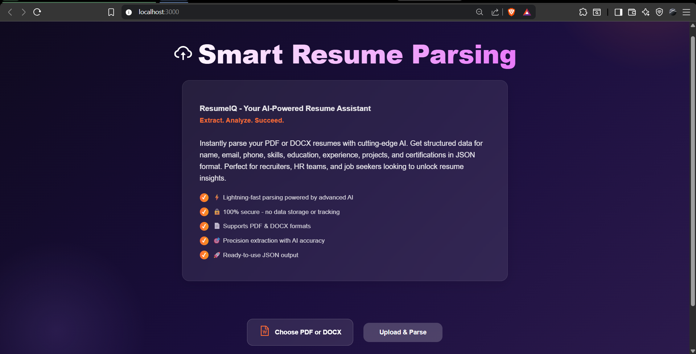
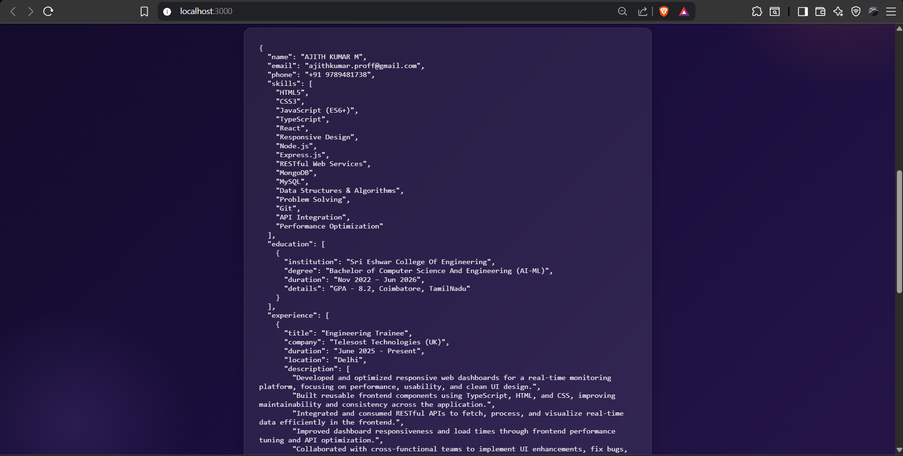

# ResumeIQ - AI-Powered Resume Parser

[](https://github.com/ajithkumarajii/ResumeIQ)
[](LICENSE)
[](https://python.org)
[](https://react.dev)

> **Smart Resume Parsing Made Simple** - Instantly extract structured data from resumes using Google Gemini AI

An intelligent resume parsing application that uses advanced AI to extract structured information from PDF and DOCX resumes instantly. Perfect for recruiters, HR professionals, and job seekers.

## 📸 Screenshots

### Landing Page - Dark Modern UI


### Resume Upload Interface


### Extracted JSON Results


## 🌟 Key Highlights

- ⚡ **Lightning Fast** - AI-powered parsing in seconds
- 🔒 **Privacy First** - No data storage, 100% secure
- 📄 **Format Support** - PDF & DOCX files
- 🎯 **Accuracy** - Powered by Google Gemini AI
- 🚀 **Production Ready** - Deploy to Vercel & Render
- 🎨 **Modern UI** - Beautiful dark theme with animations
- 📱 **Responsive** - Works on desktop and mobile

## �🚀 Features

- ⚡ Lightning-fast parsing powered by Google Gemini AI
- 🔒 100% secure - no data storage or tracking
- 📄 Supports PDF & DOCX formats
- 🎯 Precision extraction with AI accuracy
- 🚀 Ready-to-use JSON output
- 🎨 Modern, vibrant landing page UI

## 📋 Extracted Data

ResumeIQ intelligently extracts the following information:

| Field | Type | Description |
|-------|------|-------------|
| **Name** | String | Candidate's full name |
| **Email** | String | Contact email address |
| **Phone** | String | Contact phone number |
| **Skills** | Array | Technical & professional skills |
| **Education** | Array | Degrees, institutions & dates |
| **Experience** | Array | Job titles, companies & dates |
| **Projects** | Array | Notable projects & achievements |
| **Certifications** | Array | Industry certifications & credentials |

## 🛠️ Tech Stack

### Frontend
| Technology | Purpose |
|-----------|---------|
| **React 18.2** | UI library |
| **Framer Motion** | Smooth animations |
| **React Icons** | Icon library |
| **Axios** | HTTP client |
| **CSS3** | Modern styling |

### Backend
| Technology | Purpose |
|-----------|---------|
| **FastAPI** | Web framework |
| **Uvicorn** | ASGI server |
| **Google Gemini AI** | Resume parsing AI |
| **pdfplumber** | PDF extraction |
| **python-docx** | DOCX extraction |

## 📦 Installation

### Prerequisites
- Node.js (v14 or higher)
- Python 3.8+
- Git

### Backend Setup

1. Navigate to backend folder:
```bash
cd backend
```

2. Install Python dependencies:
```bash
pip install fastapi uvicorn python-dotenv pdfplumber python-docx google-generativeai
```

3. Create `.env` file with your Gemini API key:
```
GEMINI_API_KEY=your_actual_gemini_api_key
```

4. Start the FastAPI server:
```bash
uvicorn main:app --reload
```

Backend will run at: `http://localhost:8000`

### Frontend Setup

1. Navigate to frontend folder:
```bash
cd frontend
```

2. Install Node.js dependencies:
```bash
npm install
```

3. Start the React development server:
```bash
npm start
```

Frontend will run at: `http://localhost:3000`

## 🔑 API Key Setup

1. Get your Google Gemini API key from [Google AI Studio](https://makersuite.google.com/app/apikey)
2. Create a `.env` file in the `backend` folder
3. Add your API key:
```
GEMINI_API_KEY=your_key_here
```

## 📝 API Endpoints

### POST `/parse_resume/`
Parse a resume file and extract structured data.

**Request:**
- `file` (multipart/form-data): PDF or DOCX file

**Response:**
```json
{
  "name": "John Doe",
  "email": "john@example.com",
  "phone": "+1-234-567-8900",
  "skills": ["Python", "React", "FastAPI"],
  "education": [...],
  "experience": [...],
  "projects": [...],
  "certifications": [...]
}
```

## 🌐 How to Use

1. **Open Application**
   - Navigate to `http://localhost:3000`

2. **Upload Resume**
   - Click "Choose PDF or DOCX"
   - Select your resume file
   - Click "Upload & Parse"

3. **View Results**
   - See extracted JSON data
   - Copy or download the JSON
   - Use in your applications

## 📊 Architecture

```
┌─────────────────────────────────────────────────────────┐
│                    ResumeIQ Application                 │
├─────────────────────────────────────────────────────────┤
│                                                         │
│  ┌─────────────────┐           ┌──────────────────┐   │
│  │  React Frontend │  ◄────►   │  FastAPI Backend │   │
│  │  (Vercel)       │  HTTP/API │  (Render)        │   │
│  └─────────────────┘           └──────────────────┘   │
│         │                               │              │
│         │                               ▼              │
│         │                      ┌──────────────────┐   │
│         │                      │ Google Gemini AI │   │
│         │                      └──────────────────┘   │
│         │                                              │
│         ▼                                              │
│   Beautiful UI with                 PDF/DOCX          │
│   • Dark theme                       Extraction       │
│   • Animations                       & Parsing        │
│   • Responsive design                                │
│                                                         │
└─────────────────────────────────────────────────────────┘
```

## 🌐 How to Use

## 🔐 Security

- ✅ Files are processed in-memory only
- ✅ No data is stored on servers
- ✅ No tracking or analytics
- ✅ Direct API communication
- ✅ CORS enabled for local development

## 📂 Project Structure

```
ResumeParser/
├── backend/
│   ├── main.py           # FastAPI application
│   └── .env             # API keys (not uploaded)
├── frontend/
│   ├── src/
│   │   ├── App.js       # Main React component
│   │   ├── App.css      # Styling
│   │   ├── Spinner.js   # Loading spinner
│   │   └── index.js     # Entry point
│   ├── public/
│   │   └── index.html   # HTML template
│   └── package.json     # Dependencies
├── .gitignore           # Git ignore rules
└── README.md           # This file
```

## 🚀 Deployment

### Backend (FastAPI)
- Deploy on Heroku, Railway, Render, or AWS
- Set environment variables for API keys
- Ensure CORS is configured for frontend URL

### Frontend (React)
- Build: `npm run build`
- Deploy on Vercel, Netlify, or GitHub Pages

## 🤝 Contributing

Feel free to fork this project and submit pull requests for any improvements.

## 📄 License

This project is open source and available under the MIT License.

## 👨‍💻 Author

Created with 🔥 AI by [Your Name]

- GitHub: [ajithkumarajii](https://github.com/ajithkumarajii)
- LinkedIn: [ajithkumar-ai](https://linkedin.com/in/ajithkumar-ai)

## 🙏 Acknowledgments

- Google Generative AI (Gemini) for powerful AI capabilities
- FastAPI for modern Python web framework
- React for amazing frontend library
- Framer Motion for smooth animations

## ⚠️ Important Notes

- Ensure `.env` is in `.gitignore` before pushing to GitHub
- Keep your Gemini API key private
- The app works best with well-formatted resumes
- Large files may take longer to process

---

**ResumeIQ** - Smart Resume Parsing Made Simple ✨
